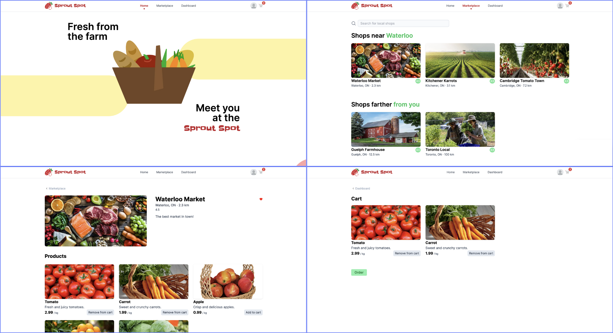

# Sprout Spot

> 🥇 StarterHacks 2024 _Best Tech_ winner

Casslie Wong • `Design + Entrepreneur` • [GitHub](https://github.com/casslies) \
Marcus Georgievski • `Developer` • [GitHub](https://github.com/marcusgeorgievski) \
Andrew Lee • `Developer` • [GitHub](https://github.com/LeeA28)

## Our Mission

At **Sprout Spot**, we connect local farms to local buyers, fostering a community that values ethically produced foods. We are committed to bringing transparency to your kitchen, ensuring you know exactly where your food comes from and how it's grown. Join us in discovering and enjoying the freshest, most sustainable produce available.

## Inspiration

Sprout Spot was inspired by the need to reduce carbon footprints and support sustainable farming practices from local business owners. We recognized the difficulty in accessing fresh, organic produce from local farms and aimed to bridge this gap by connecting farmers directly with local consumers.

## What it does

Sprout Spot is a marketplace that connects local consumers with farmers and shops in their area, allowing them to buy fresh, organic produce directly. This direct connection ensures fresher food, reduces food waste, and supports local farming communities.

## How we built it

We built Sprout Spot using Next.js and React, focusing on a fresh and minimal design. Our design incorporates accessibility features like colorblind-friendly elements and easy-to-navigate interfaces, ensuring a seamless user experience.

## Challenges we ran into

One of the main challenges was ensuring the platform has a beautiful and familiar design that is accessible to all users, including those with colorblindness and cognitive disabilities. Additionally, having to integrate a robust backend system for secure data persistence and authentication would have been a complex task given the time limitations.

## Accomplishments that we're proud of

We're proud of creating a user-friendly platform that supports local farmers and promotes sustainable practices! Our design ensures accessibility for all users, and our monetization strategy, including features like Sprout Spotlight and membership passes, provides ongoing support for local farms.

## What we learned

We learned the importance of user accessibility and the impact of design on user experience. We also gained insights into creating a sustainable business model that benefits both consumers and farmers, while supporting eco-friendly practices.

## What's next for Sprout Spot

Next, we plan to expand our market reach and incentivize local farmers to join our platform! We would also love to develop a comprehensive backend system and introduce business accounts for better shop owner management.
